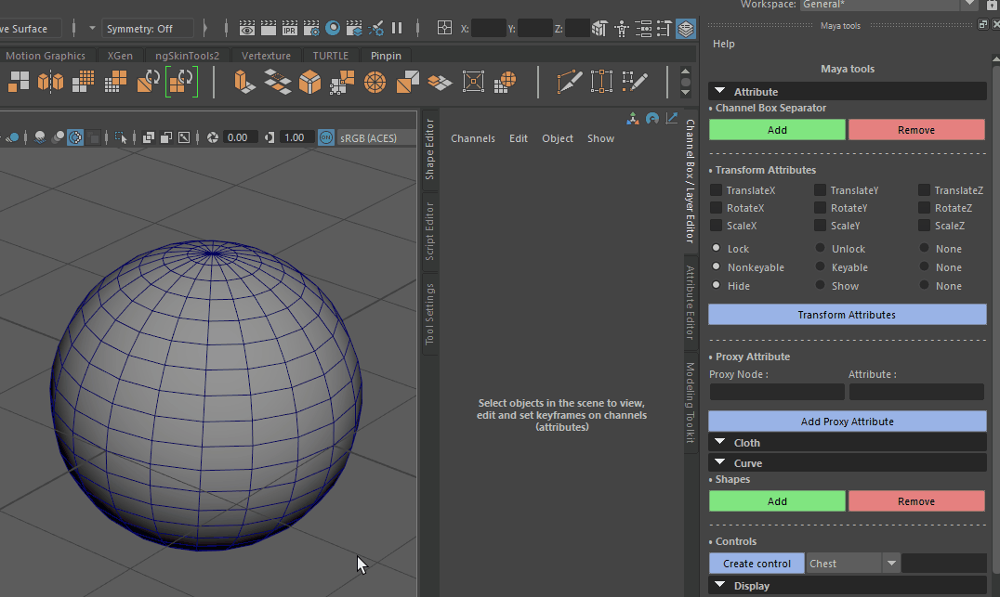
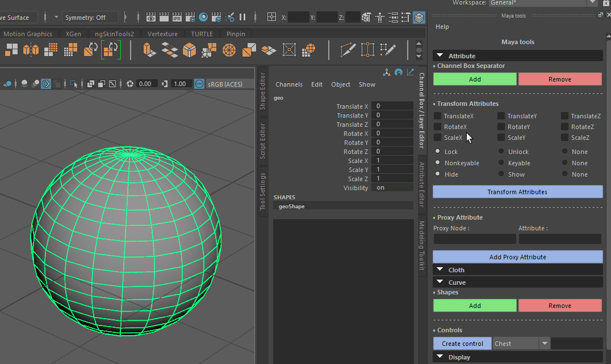
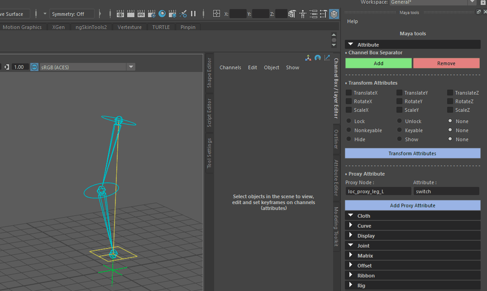
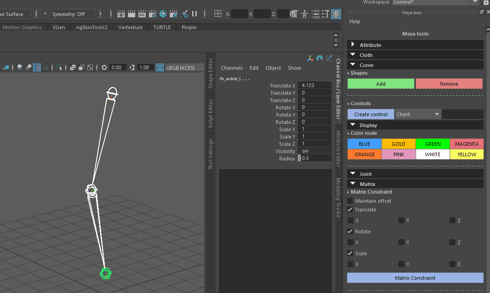
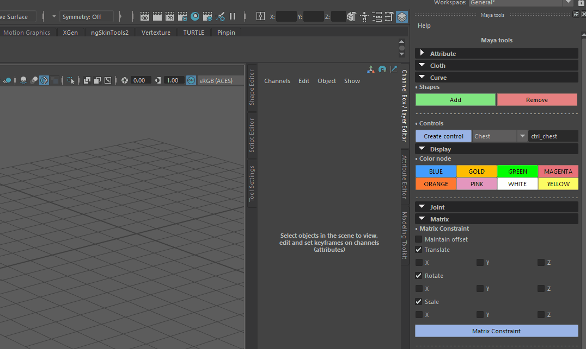
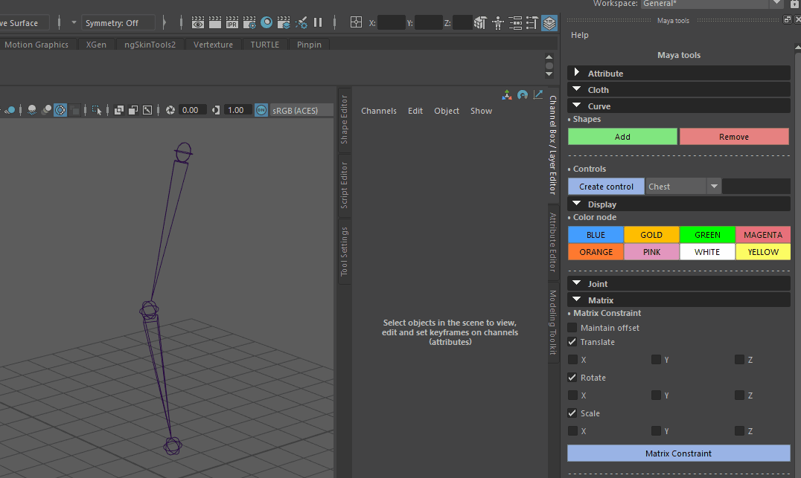
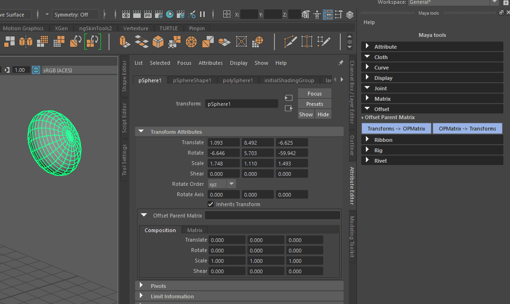

======================================
Solar Documentation (work in progress)
======================================

Contents
========

- `0. Installation`_
- `1. Attribute`_
    - `1.1 Channel Box Separator`_
    - `1.2 Transform Attributes`_
    - `1.3 Proxy Attribute`_
- `2. Cloth`_
    - `2.1 Cloth Setup`_
    - `2.2 Preroll`_
- `3. Curve`_
    - `3.1 Shapes`_ 
    - `3.2 Control`_
- `4. Display`_
    - `4.1 Color Node`_
- `5. Joint`_
- `6. Matrix`_
    - `6.1 Matrix Constraint`_
    - `6.2 Aim Matrix Constraint`_
- `7. Offset`_
    - `7.1 Offset Parent Matrix`_
- `8. Ribbon`_
    - `8.1 World Ribbon`_
    - `8.2 Bone Ribbon`_
- `9. Rig`_
    - `9.1 Spine`_
- `10. Rivet`_
    - `10.1 Rivet Mesh`_ 
    - `10.2 Rivet Nurbs`_

0. Installation
===============

1. Attribute
============

1.1 Channel Box Separator
-------------------------

Creates or removes non-keable separator attribute on animation controllers.

1.2 Transform Attributes
------------------------

Shortcut to Channel Control.

1.3 Proxy Attribute
-------------------

| In this example, we have a simple ik-fk setup with the switch attribute on a proxy node.
| To create a better setup for the animation, we create a proxy attribute on the controllers.

2. Cloth
========

2.1 Cloth Setup
---------------

2.2 Preroll
-----------

3. Curve
========

3.1 Shapes
----------

Creates circle shapes under Transform or Joint nodes, with Normal along Primary Axis.

3.2 Control
-----------

4. Display
==========

4.1 Color Node
--------------

5. Joint
========

6. Matrix
=========

6.1 Matrix Constraint
---------------------

6.2 Aim Matrix Constraint
-------------------------

7. Offset
=========

7.1 Offset Parent Matrix
------------------------

In order to keep the World Matrix of a Transform or Joint node, we can use the offsetParentMatrix attribute.

8. Ribbon
=========

8.1 World Ribbon
----------------

8.2 Bone Ribbon
---------------

9. Rig
======

9.1 Spine
---------

10. Rivet
=========

10.1 Rivet Mesh
---------------

10.2 Rivet Nurbs
----------------
